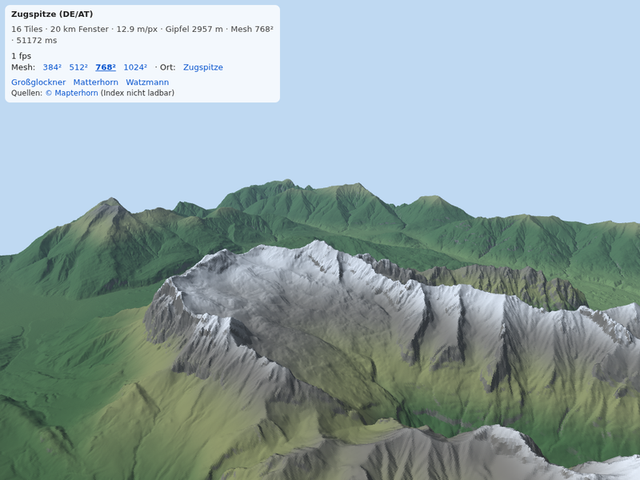

# Spike: Zugspitze in 3D aus Mapterhorn-Tiles

Ein einzelnes HTML-File, keine Build-Schritte. Zweck: prüfen, dass die
grenzübergreifenden Mapterhorn-Daten (Bayern DGM1 + BEV ALS-DGM an der
Zugspitze) nahtlos zusammenpassen und sich per WebGL auf iPad und Handy
flüssig drehen lassen. Kein Teil der späteren App.

## Was passiert

1. Ein 1536 × 1536 px großes Web-Mercator-Fenster (z12, 512-px-Tiles,
   ≈ 13 m/px, ≈ 20 km Kante) wird um den Gipfel gelegt und aus 9 bis 16
   Tiles von `tiles.mapterhorn.com` in ein Canvas gezeichnet.
2. Das Canvas geht unverändert (Terrarium-RGB) als Textur auf die GPU. Die
   Shader dekodieren `R·256 + G + B/256 − 32768`. Dadurch sind keine
   Float-Texturen nötig, was auf iOS der sichere Weg ist.
3. Ein regelmäßiges Gitter (Standard 768² auf Tablet/Desktop, 512² auf dem
   Handy) wird im Vertex-Shader per `texelFetch` auf die DEM-Höhe gehoben.
4. Der Fragment-Shader berechnet die Normale aus dem vollaufgelösten DEM
   (zentrale Differenzen), färbt nach Höhe und Hangneigung (Tal, Wald,
   Matte, Fels, Schnee), beleuchtet mit Lambert und blendet mit der
   Entfernung in die Himmelsfarbe.
5. Steuerung im Karten-Schema (three.js `OrbitControls` mit angepasster
   Belegung): **ein Finger verschiebt** den Standort über das Gelände,
   **zwei Finger** zoomen (Pinch), drehen (seitlich ziehen) und kippen
   (hoch/runter ziehen). Maus: links verschieben, rechts oder Strg+links
   drehen und kippen, Rad zoomt zur Mausposition. Der Drehpunkt liegt
   immer auf dem Boden, der Blick kann nicht unter den Boden, und der
   Standort bleibt im geladenen Fenster.
6. Die sichtbaren Datenquellen kommen aus Mapterhorns
   `coverage-index.pmtiles` und werden als Attribution angezeigt.

## URL-Parameter

| Parameter | Bedeutung | Standard |
|---|---|---|
| `p` | Ort: `zugspitze`, `grossglockner`, `matterhorn`, `watzmann` | `zugspitze` |
| `lon`, `lat` | eigener Mittelpunkt (überschreibt `p`) | |
| `mesh` | Gitterauflösung pro Kante: 384, 512, 768, 1024 | 768, Handy 512 |
| `win` | Fensterkante in Mercator-Pixeln | 1536 |
| `z` | Mapterhorn-Tile-Zoom | 12 |
| `tiles` | Basis-URL der Tiles, z. B. ein lokaler Cache | `https://tiles.mapterhorn.com/` |

## Lokal testen

    python3 -m http.server 8765 --directory spike
    # http://localhost:8765/zugspitze/

Die Bibliotheken kommen von jsDelivr (three 0.170, pmtiles 4.3). Für
Offline-Tests die drei Module herunterladen und die Importmap auf lokale
Pfade zeigen lassen.

## Ergebnis der Headless-Prüfung (Chromium, SwiftShader)

| Ort | Tiles | DEM-Gipfel | Katalog |
|---|---|---|---|
| Zugspitze | 16 | 2957 m | 2962 m |
| Großglockner | 16 | 3795 m | 3798 m |
| Matterhorn | 16 | 4472 m | 4478 m |
| Watzmann | 16 | 2706 m | 2713 m |

An der Zugspitze ist an der DE/AT-Grenze keine Stufe zwischen Bayern DGM1
und BEV-DGM zu sehen. Die Bildrate ist im Software-Renderer nicht
aussagekräftig; auf dem Gerät prüfen.
